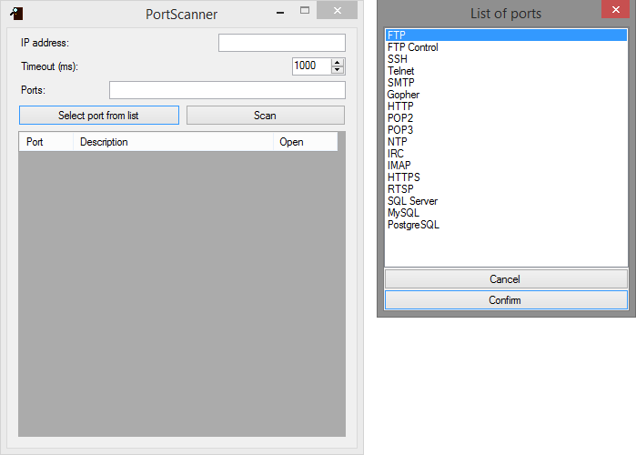

# PortScanner
PortScanner is a tool for TCP port scanning.

## Screenshot

## Features
* Lightweight GUI made with Windows Forms
* Customizable list of known ports
* Port interval scanning
* Asynchronous port scanning
* Adjustable timeout for port scanning

## Supported languages
* English
* Portuguese

## Prerequisites
PortScanner requires [.NET Framework 4.5](https://dotnet.microsoft.com/download/dotnet-framework/net45).

## License
This project is licensed under GNU General Public License v3.0 - see [LICENSE](LICENSE) for more details.
